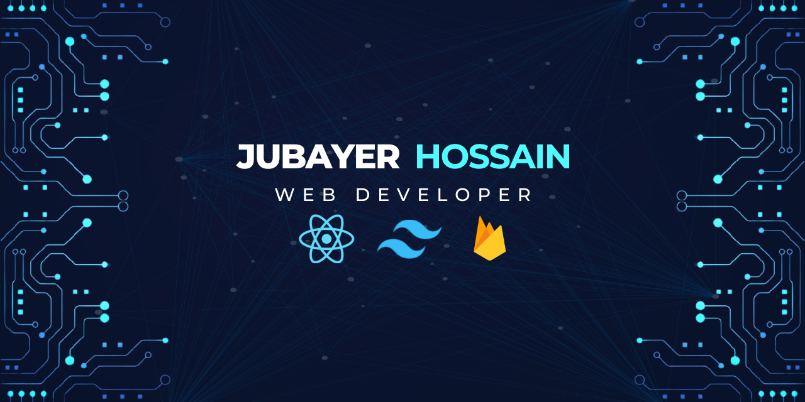

    

# About Me

Hello, I'm Jubayer Hossain, a dedicated front-end web developer proficient in HTML, CSS, and JavaScript, with expertise in React, Tailwind CSS, and Firebase. My current focus is on expanding my skills to encompass Node.js and Express.js for backend development, with the ultimate goal of becoming a full-stack developer. I'm passionate about creating seamless and visually appealing user experiences, and I'm excited to bring a holistic approach to web development by bridging the gap between front-end and back-end technologies. Let's connect and build something amazing! 🚀

# Some Tools I Have Used and Learned

🔭 Currently refining full-stack skills, diving into Node.js and Express.js to bolster backend expertise for comprehensive web apps.

🌱 Learning backend intricacies, exploring Node.js and Express.js to seamlessly integrate with front-end skills, enhancing overall web development capabilities.

👯 Seeking collaborations on innovative web projects, merging creative front-end design with robust backend functionality for dynamic team contributions.

🤔 Looking for help mastering advanced backend concepts, eager for guidance from experienced developers to accelerate learning in Node.js and Express.js.

💬 Ask me about front-end development, React, Tailwind CSS, Firebase, or anything related to crafting engaging web experiences.

📫 Connect on https://www.linkedin.com/in/jubayer-hossain-8b2499249/ or email me at jubaerlikhon352@gmail.com.

⚡ Fun fact: Beyond coding, I explore hiking trails and capture nature's beauty through photography.